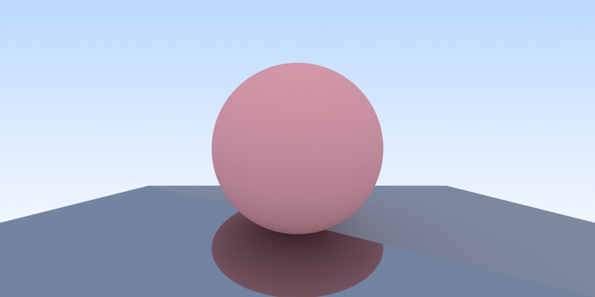
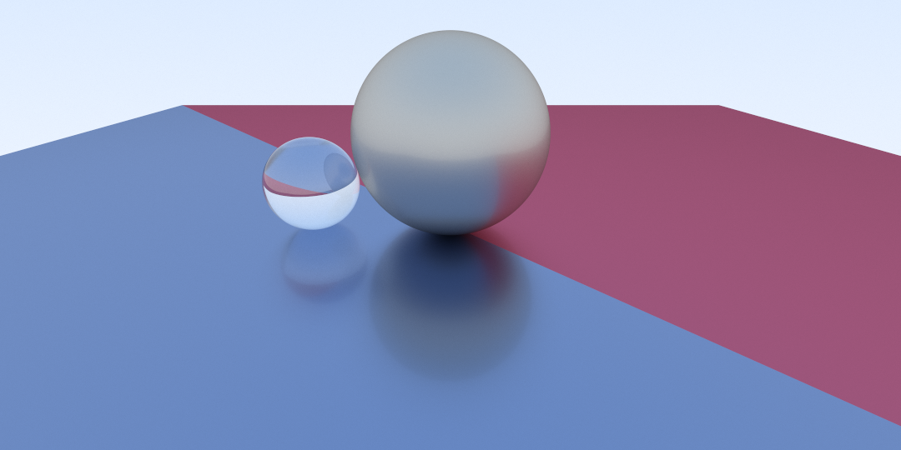
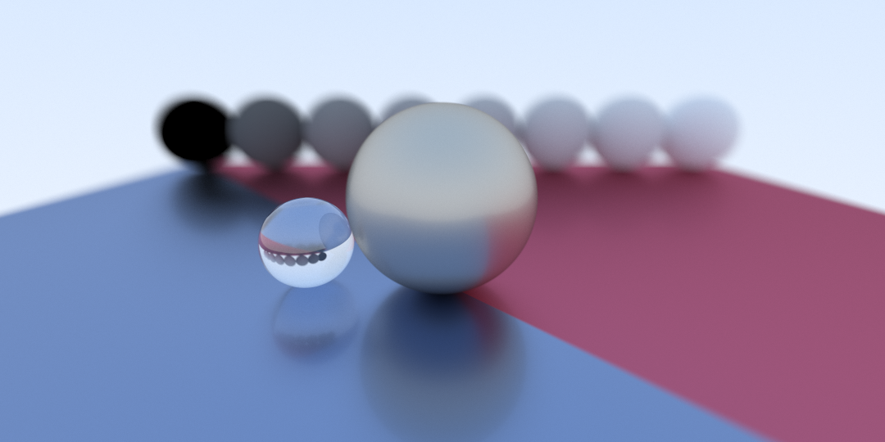
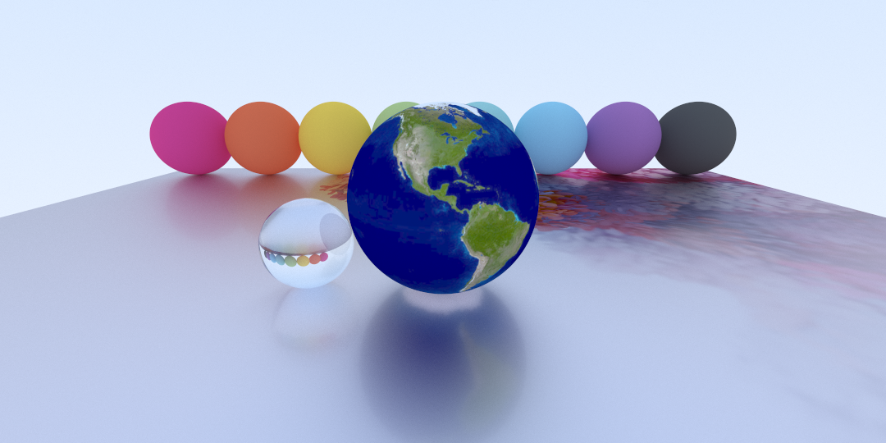

# RayTracer

这是一个光线追踪框架，代码的原理和实现参考了[Ray Tracing in One Weekend Book Series](https://github.com/RayTracing/raytracing.github.io)的前两本的部分内容。

这只是一个个人学习的作品，不排除存在未发现的问题的可能。

程序中用到了[GLM](https://github.com/g-truc/glm)。

**Usage**:

```
./program [output path] [sample number]
```

## Gallery

- 漫反射与镜面反射


- 材质


- 景深


- 纹理


- 全局光照
